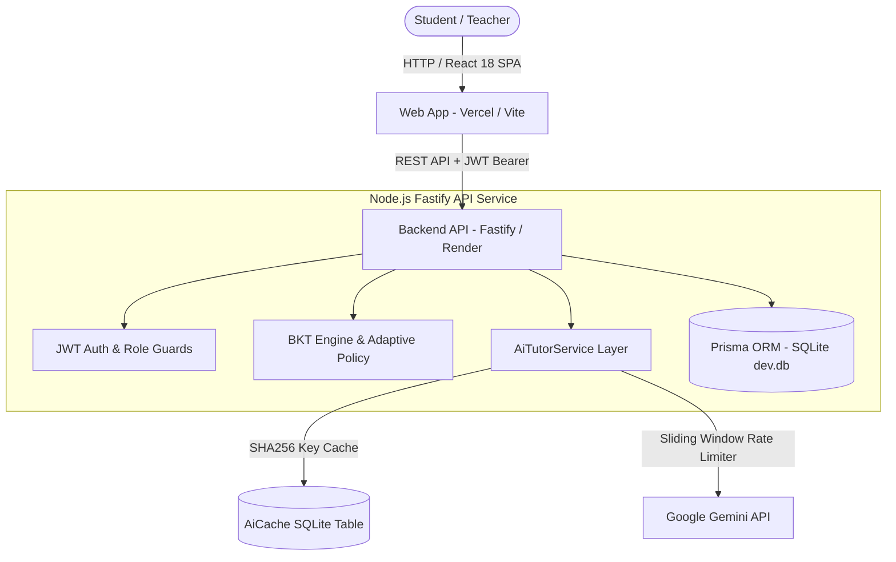

# 🎓 Plataforma de Tutoria Adaptativa (Intelligent Tutoring System)

A production-grade, full-stack **Adaptive Tutoring Platform** designed for teachers and students. Built with **React 18**, **Node.js + Fastify**, **SQLite + Prisma ORM**, **Bayesian Knowledge Tracing (BKT)** engine, and **Google Gemini API** for personalized AI feedback.

> **Product UI Language:** Brazilian Portuguese (`pt-BR`)  
> **Code identifiers & comments:** English (`en-US`)

---

## 📐 System Architecture



### Monorepo Structure

```
escola/
├── apps/
│   ├── api/             # Fastify TypeScript backend API & Gemini integration layer
│   └── web/             # React 18 + Vite + TailwindCSS pt-BR frontend
├── packages/
│   ├── bkt-engine/      # Standalone Bayesian Knowledge Tracing & adaptive policy package
│   └── shared-types/    # Shared TypeScript DTOs, interfaces, and enums
├── package.json         # Workspace root package.json
├── pnpm-workspace.yaml  # Monorepo pnpm workspace configuration
└── README.md
```

---

## 💰 Free Tier Budget & Production Constraints

| Service Component    | Chosen Provider & Tier        | Verified Free Limits                              | Safeguards & Usage Strategy                              |
| -------------------- | ----------------------------- | ------------------------------------------------- | -------------------------------------------------------- |
| **Frontend Hosting** | Vercel (Hobby)                | 100 GB transfer/mo, unlimited static deploys      | ~1 GB/mo expected. Fast global CDN.                      |
| **Backend Hosting**  | Render (Free Web Service)     | 750 hrs/mo, 512 MB RAM (sleeps after 15 min idle) | Free web service. _Note: Cold starts take ~30s._         |
| **Database**         | SQLite + Prisma ORM           | File-based local/volume storage                   | 0ms network latency. Admin export endpoint provided.     |
| **AI Processing**    | Google Gemini API (Free Tier) | 15 RPM, 1,500 RPD                                 | SQLite-backed `AiCache` + in-process rate limiter queue. |
| **Authentication**   | Self-Hosted JWT               | Unlimited                                         | `bcryptjs` + Fastify JWT access/refresh tokens.          |
| **CI / CD**          | GitHub Actions                | 2,000 min/mo for public repositories              | Automated linting, type-checking, and test suite on PRs. |

### SQLite Production Trade-Offs & Persistence Strategy

- **Single-Writer Concurrency:** SQLite handles heavy concurrent read operations easily and serializes write operations via WAL mode.
- **Ephemeral Host Filesystem:** On free cloud hosts (e.g. Render free web services), container redeployments may reset local ephemeral files.
- **Mitigation & Export:** An authenticated administrative backup export endpoint (`GET /api/admin/export-db`) is included to export the SQLite database file on demand.

---

## 🧠 Bayesian Knowledge Tracing (BKT) & Adaptive Selection

### 1. Bayesian Knowledge Tracing Model

For each (student, Knowledge Component) pair, the probability $P(L_t)$ that the student has mastered the concept is updated after every question attempt:

1. **Posterior Probability after observation:**
   $$\text{If Correct: } P(L_{t-1} \mid \text{obs}) = \frac{P(L_{t-1}) \cdot (1 - p_{\text{slip}})}{P(L_{t-1}) \cdot (1 - p_{\text{slip}}) + (1 - P(L_{t-1})) \cdot p_{\text{guess}}}$$
   $$\text{If Incorrect: } P(L_{t-1} \mid \text{obs}) = \frac{P(L_{t-1}) \cdot p_{\text{slip}}}{P(L_{t-1}) \cdot p_{\text{slip}} + (1 - P(L_{t-1})) \cdot (1 - p_{\text{guess}})}$$

2. **Learning Opportunity (Transition):**
   $$P(L_t) = P(L_{t-1} \mid \text{obs}) + (1 - P(L_{t-1} \mid \text{obs})) \cdot p_{\text{transit}}$$

### 2. Adaptive Question Selection Strategy

- **Productive Struggle Band ($0.40 \le P(L) \le 0.70$):** Prioritizes questions in concepts where learning momentum is highest.
- **Spaced Repetition:** Interleaves mastered concepts ($P(L) > 0.70$) to prevent decay.
- **Anti-Repetition:** Excludes the student's 5 most recent question IDs per session.

---

## 🚀 Quick Start (Local Development - No Docker)

### Requirements

- Node.js >= 18.x
- pnpm >= 8.x (No Docker required)

### Setup Steps

```bash
# 1. Install dependencies
pnpm install

# 2. Configure environment variables
cp .env.example .env
cp apps/api/.env.example apps/api/.env
cp apps/web/.env.example apps/web/.env

# 3. Run database migrations & seed demo data (pt-BR)
pnpm --filter @escola/api db:migrate

# 4. Start dev server (API on :3001, Web on :3000)
pnpm dev
```

### Running Tests

```bash
# Run unit & integration test suites across monorepo
pnpm test
```

---

## 🔑 Demo Account Credentials (pt-BR)

- **Teacher Account:**
  - E-mail: `prof.carlos@escola.edu.br`
  - Password: `senha123`
- **Student Accounts:**
  - E-mail: `aluno.lucas@escola.edu.br` (password: `senha123`)
  - E-mail: `aluna.mariana@escola.edu.br` (password: `senha123`)
  - E-mail: `aluno.pedro@escola.edu.br` (password: `senha123`)

---

## ⚠️ Known Limitations

1. **Backend Cold Starts on Free Tier:** Free Render instances sleep after 15 minutes of inactivity. The initial request after sleep may take ~30 seconds.
2. **Gemini API Free Rate Limits:** Gemini free tier limits requests to 15 RPM. The system uses an in-process rate limiter with SQLite caching to stay within limits, falling back gracefully to static pt-BR feedback if exceeded.
